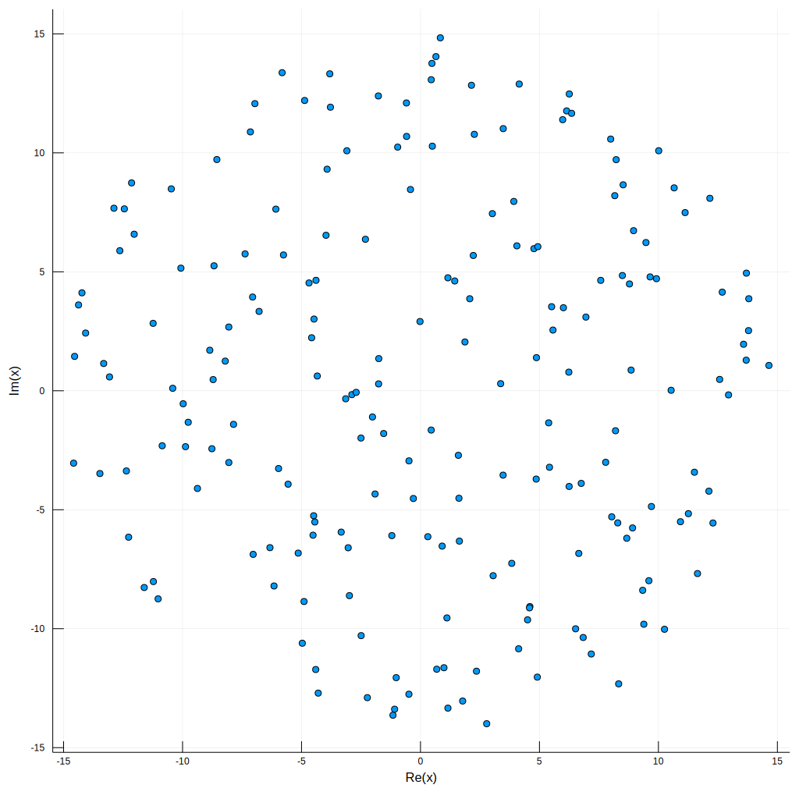
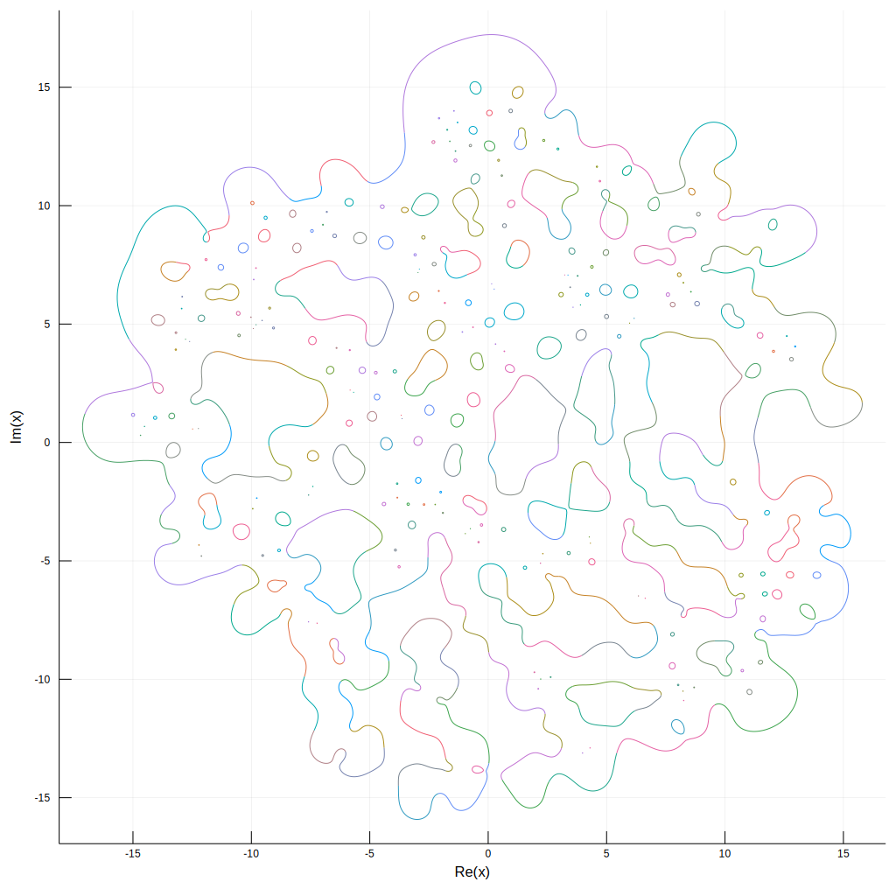
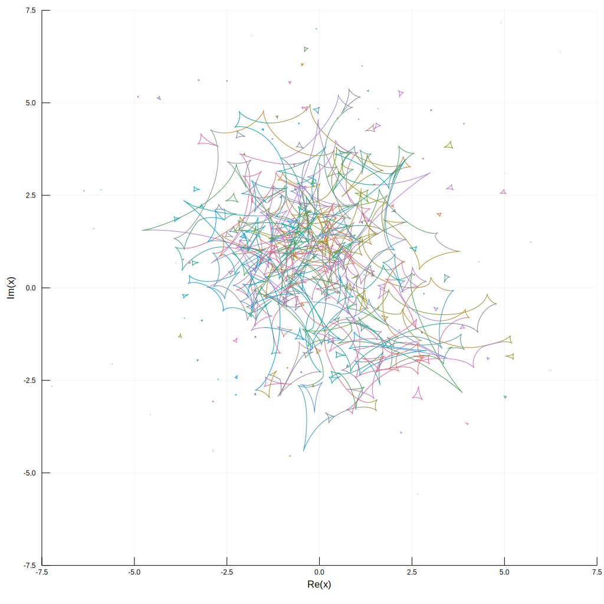

[](https://doi.org/10.5281/zenodo.13858464)


# Microlensing.jl
[](https://travis-ci.com/mikle97pir/Microlensing.jl)

Some tools for simulating gravitational microlensing.

## Basic usage
The package can do three things: calculate critical curves, calculate caustics and plot magnification maps.


```julia
]add https://github.com/mikle97pir/Microlensing.jl # adding the package
using Microlensing # importing the package
```


```julia
using Plots # the standard library for plotting
using Random
```

Let us generate 200 stars uniformly distributed in a circle of radius 15 (measured in solar Einstein radii). The masses of all stars are equal to the mass of the Sun by default.


```julia
nstars = 200
rad = 15.

Random.seed!(0); stars = generate_stars_ell(nstars, rad)

scatter(
    [star.pos for star in stars], 
    aspect_ratio = 1, 
    legend = false, 
    size = (1024, 1024),
    format = :svg
)
```





It is not hard to compute the critical curves and the caustics. We choose `E = 1` and `Λ = 1`, which means positive parity and no external shear.


```julia
E = 1.
Λ = 1.

crit_curves = calc_crit_curves(stars, E=E, Λ=Λ)
caustics = calc_caustics(stars, crit_curves, E=E, Λ=Λ)
```


```julia
P = plot(
    legend = false, 
    aspect_ratio = 1, 
    size = (1024, 1024),
    format = :svg
)

for curve in crit_curves
    plot!(P, curve)
end
P
```





```julia
P = plot(
    legend = false, 
    aspect_ratio = 1, 
    size = (1024,1024), 
    xlim = (-7.5,7.5), 
    ylim = (-7.5,7.5), 
    format = :svg
)

for curve in caustics
    plot!(P, curve)
end
P
```





Let us prepare for the computing of the magnification map. We are going to shoot the rays from a `40x40` square. It is big enough to contain all the critical curves. The image square will be `15x15`, because it contains all the caustics. The width is measured in Einstein radii of the Sun.

We set `nrows = ncols = 4096` for `domain`, which means that the whole number of rays is equal to `nrows*ncols*nshare*nint = 4096*4096*4*4`. Actually, the domain is a rectangle with `height = width / ncols * nrows`. Similarly, the `nrows = ncols = 1024` for the image mean that the resulting map will have resolution `1024x1024`.


```julia
domain = RectGrid(
    width = 40.,
    nrows = 4096,
    ncols = 4096
)

image = RectGrid(
    width = 15.,
    nrows = 1024,
    ncols = 1024
)

tree = build_tree(stars, width=2*rad)

problem = NumMLProblem(
    T = tree,
    nstars = nstars,
    nshare = 4,
    nint = 4,
    E = E,
    Λ = Λ
)
```


```julia
mag = calc_mag(problem, domain, image)
```


```julia
heatmap(
    log.(mag), 
    aspect_ratio=1, 
    legend=false, 
    yflip=true, 
    axis=false, 
    grid=false, 
    size=reverse(size(mag)), 
    format=:svg
)
```


## Parallel computing
All the computations can be done in a parallel way.


```julia
using Distributed
addprocs() # adds all the cores
```


```julia
@everywhere using Microlensing # loads the package on all the cores
```


```julia
par_crit_curves = par_calc_crit_curves(stars, E=E, Λ=Λ)
caustics = calc_caustics(stars, crit_curves, E=E, Λ=Λ) # it is fast enough on a single core
```


```julia
par_mag = par_calc_mag(problem, domain, image)
```

## Documentation

There are [docs](https://mikle97pir.github.io/Microlensing.jl/dev) for the source code.
