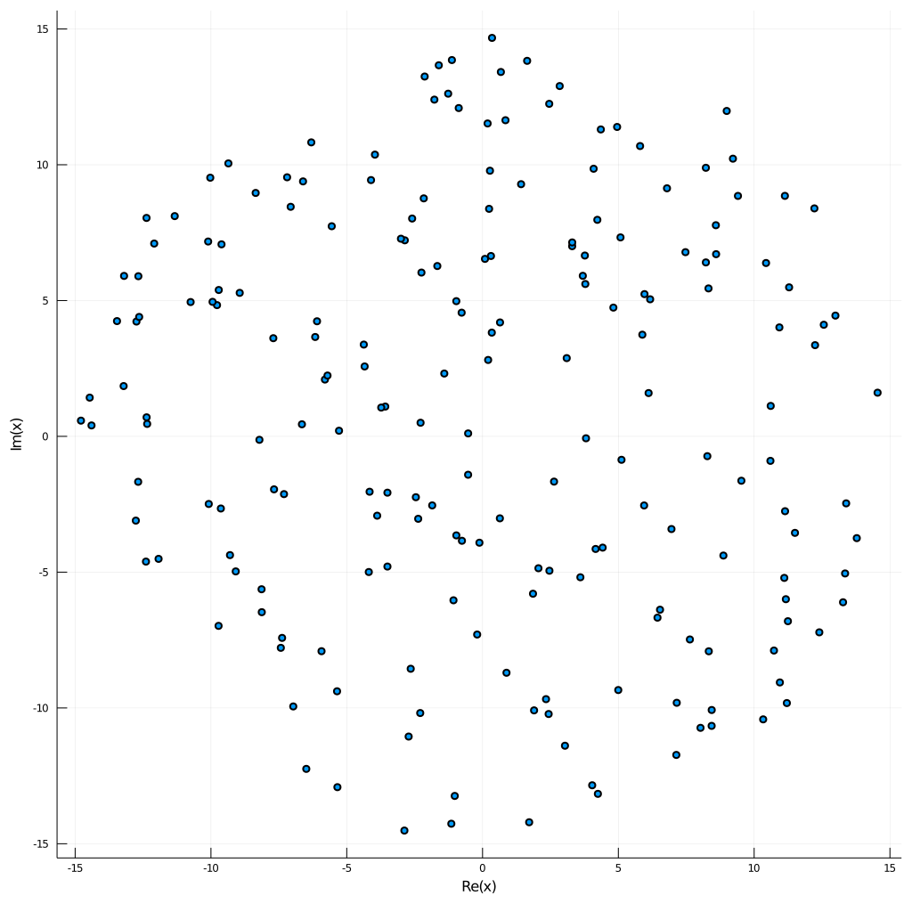

# Microlensing.jl
[](https://travis-ci.com/mikle97pir/Microlensing.jl)

Some tools for simulating gravitational microlensing.

## Basic usage
The package can do three things: calculate critical curves, calculate caustics and plot magnification maps.


```julia
]add https://github.com/mikle97pir/Microlensing.jl # adding the package
using Microlensing # importing the package
```


```julia
using Plots # the standard library for plotting
using Random; Random.seed!(0) # fixing the seed to make the results consistent
```

Let us generate 200 stars uniformly distributed in a circle of radius 15 (measured in solar Einstein radii). The masses of all stars are equal to the mass of the Sun by default.


```julia
stars = generate_stars_ell(200, 15)
masses = [star.mass for star in stars]
positions = [star.pos for star in stars]
scatter(positions, aspect_ratio=1, legend=false, size=(1024, 1024))
```





It is not hard to compute the critical curves and the caustics. We choose `E = 1` and `Λ = 1`, which means positive parity and no external shear.


```julia
crit_curves = calc_crit_curves(masses, positions, 1., 1.)
caustics = calc_caustics(masses, positions, 1., 1., crit_curves)
```


```julia
P = plot(legend=false, aspect_ratio=1, size=(1024, 1024))
for curve in crit_curves
    plot!(P, curve)
end
P
```


```julia
P = plot(legend=false, aspect_ratio=1, size=(1024,1024), xlim=(-7.5,7.5), ylim=(-7.5,7.5))
for curve in caustics
    plot!(P, curve)
end
P
```


Let us prepare for the computing of the magnification map. We are going to shoot the rays from a `40x40` square. It is big enough to contain all the critical curves. The image square will be `15x15`, because it contains all the caustics. We choose `resol=1024`, which means that the resolution of the resulting map will be `1024x1024`. The whole number of rays will be `ngrid^2*nshare^2*nint^2`.


```julia
domain = Cell(0., 40.)
image = Cell(0., 15.)
tree = build_tree(stars, 40.)
problem = NumMLProblem(T=tree, nstars=200, ngrid=4096, nshare=4, nint=4, resol=1024, E=1., Λ=1.)
```


```julia
mag = calc_mag(problem, domain, image)
```


```julia
heatmap(log.(mag), aspect_ratio=1, legend=false, yflip=true, axis=false, grid=false, size=(1024, 1024))
```


## Parallel computing
All the computations can be done in a parallel way.


```julia
using Distributed
addprocs() # adds all the cores
```


```julia
@everywhere using Microlensing # loads the package on all the cores
```


```julia
crit_curves = par_calc_crit_curves(masses, positions, 1., 1.)
caustics = calc_caustics(masses, positions, 1., 1., crit_curves) # it is fast enough on a single core
```


```julia
mag = par_calc_mag(problem, domain, image) # the progress bar does not work yet
```

## Documentation

There are [docs](https://mikle97pir.github.io/Microlensing.jl/dev) for the source code.
